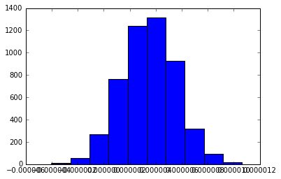
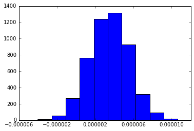

A recent issue I had in my research is tick labels that overlap each other. It happens when there are too many leading zeros before the significant digit, yet too loo little for `matplotlib` to intelligently shift to scientific notation (about 4-7 leading zeroes). That result in the tick labels overlapping and making everything unreadable. It is not that much of a problem on exploratory code, but when I need a paper-worthy chart, it's an issue.


```python
import matplotlib.pyplot as plt
import numpy as np
%matplotlib inline

# Create random data of 
x = np.random.normal(loc = 0.0000035, scale= 0.000002, size = 5000)
print x
```

    [  6.50065989e-06  -4.97020382e-07   2.64611222e-06 ...,   4.43189644e-06
       1.41286765e-06   2.19814577e-06]
    

I have 5000 samples from the normal distribution. The samples have about 6 leading zeroes. Next, I'll create a histogram for the samples.


```python
fig, axs = plt.subplots()
axs.hist(x)
plt.show()
```





You can see how the labels of the x axis are overlapping and you can't understand any of them. I wanted a fast yet elegant way to deal with this. I didn't want to mess with `rcParams` for now (Although probably better in the long run).  
`.get_xticks()` method returns a `numpy array` of all the labels. Now with the easy slicing mechanism of `numpy arrays` I can get all even places.  
`.set_xticks()` method can set the new ticks to that value.


```python
fig, axs = plt.subplots()
axs.hist(x)
axs.set_xticks(axs.get_xticks()[::2])
plt.show()
```





I guess there are more efficient ways, if you have many ticks on a many `axes` object, but this is a nice, elegant hack if you need it for a few paper-worthy charts, without the hassle.
